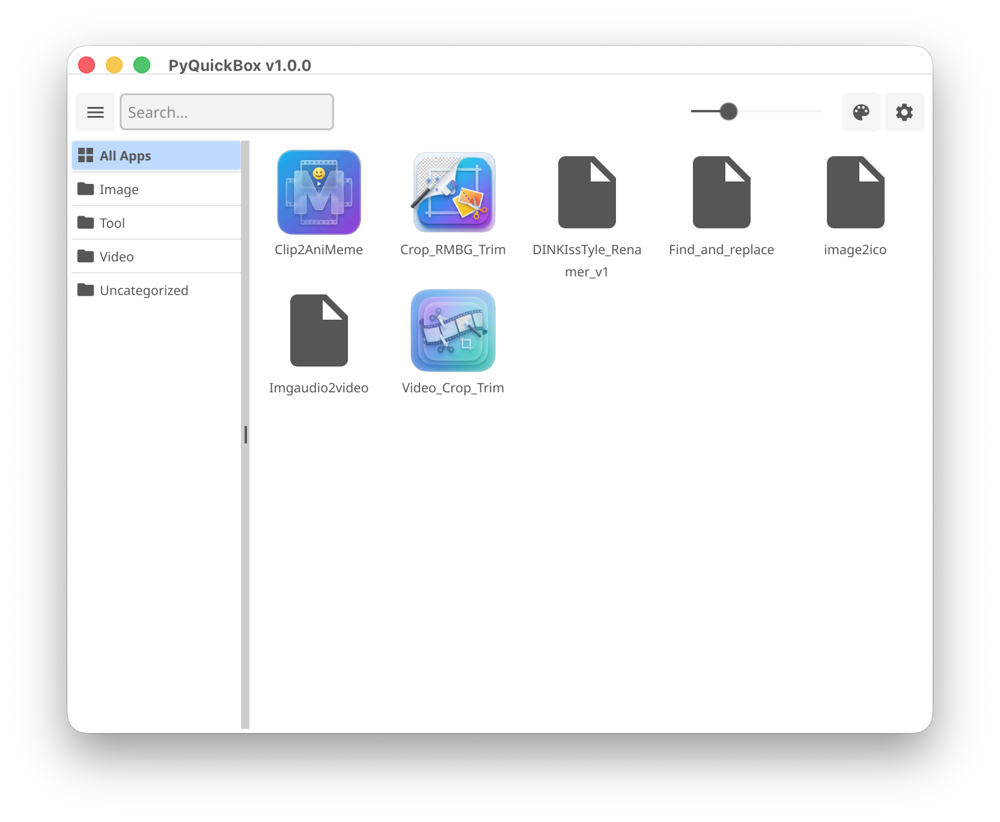

# 🚀 PyQuickRun & PyQuickBox

**PyQuickRun**과 **PyQuickBox**는 **Windows, macOS, Linux** 환경에서 Python(`.py`) 스크립트를 손쉽게 실행하고 관리할 수 있도록 설계된 경량 도구입니다.

---

## 🧩 PyQuickRun이란?

  

**PyQuickRun**은 Python(`.py`) 스크립트를 쉽게 실행할 수 있게 도와주는 런처입니다.

- 더블 클릭으로 스크립트 실행
- 사용할 Python 인터프리터 선택 가능
- 터미널(콘솔) 실행 여부 결정
- 특수 헤더가 정의되지 않아도 작동

---

## 🗂 PyQuickBox란?

  

**PyQuickBox**는 Python 스크립트를 **수집, 분류, 탐색 및 검색**할 수 있는 런치패드입니다.

- 카테고리별 스크립트 정리
- 그리드 기반의 시각적 탐색
- 즉각적인 스크립트 검색 및 필터링
- PyQuickRun과 완벽하게 연동

---

## 🔧 공통 기능: `#pqr` 헤더

두 도구 모두 `.py` 파일 내에 직접 포함되는 `#pqr`이라는 특수 헤더를 지원합니다.

이 헤더를 통해 다음 내용을 **미리 정의**할 수 있습니다:
- 사용할 Python 인터프리터
- 터미널에서 실행할지 여부
- 플랫폼별 설정 (Windows / macOS / Linux)
- 스크립트 카테고리 (PyQuickBox에서 사용)

---

### 기본 `#pqr` 구조
#pqr cat=Category;
win=Path\to\python.exe;
mac=/path/to/python;
linux=/path/to/python;
term=true;

---

## 📌 예시

### ▶ 터미널을 열지 않고 Windows에서 실행
#pqr win=C:\Users\your_user\AppData\Local\Programs\Python\Python310\python.exe;term=false;

### ▶ macOS에서 특정 .venv를 사용하여 실행
#pqr mac=/Users/your_user/pythons/default/.venv/bin/python;term=false;

### ▶ PyQuickBox용 카테고리 정의
#pqr cat=Utilities;win=C:\Users\your_user\AppData\Local\Programs\Python\Python310\python.exe;term=true;

> `cat=`은 PyQuickBox에서 분류(Categorization) 목적으로만 사용됩니다.

---

## ✏ `#pqr` 편집

- `.py` 파일 내부에 직접 `#pqr`을 작성할 수 있습니다.
- 또는 PyQuickBox의 **속성 패널(Properties panel)**을 통해 편집할 수도 있습니다.

---

# 📦 설치 가이드

## 🪟 Windows

1. 다음 링크에서 Windows 릴리스를 다운로드합니다:  
   https://github.com/DINKIssTyle/PyQuickRun/releases
2. 원하는 폴더에 압축을 풉니다.
3. `.py` 파일을 우클릭 → **연결 프로그램 (Open with)** → **PyQuickRun** 선택
4. `.py` 파일의 기본 앱으로 설정합니다.

---

## 🍎 macOS

1. 다음 링크에서 macOS 릴리스를 다운로드합니다:  
   https://github.com/DINKIssTyle/PyQuickRun/releases
2. `/Applications` 또는 `~/Applications` 폴더에 압축을 풉니다.
3. `.py` 파일을 선택 → **Command + I** (정보 가져오기)
4. **다음으로 열기 (Open with):** 항목에서 PyQuickRun 선택
5. **모두 변경 (Change All)** 클릭

---

## 🐧 Ubuntu / Linux

1. 다음 링크에서 Linux 릴리스를 다운로드합니다:  
   https://github.com/DINKIssTyle/PyQuickRun/releases
2. 압축을 풀고 `home/` 디렉터리에 병합합니다.
3. `.py` 파일을 PyQuickRun과 연결합니다.

---

# ▶ PyQuickRun – 기본 사용법

- `#pqr`이 없어도 **Interpreter Path(인터프리터 경로)** 설정을 통해 스크립트가 실행됩니다.
- **Browse**를 클릭하여 기본 Python 실행 파일을 선택하세요.
- **Run in Terminal / Command (터미널/커맨드에서 실행)**
  - 터미널 실행 여부를 제어합니다.
  - `#pqr term=` 설정이 있을 경우 그 설정이 우선합니다.
- **Close window after successful execution (실행 성공 후 창 닫기)**
  - 완료 후 PyQuickRun 창을 닫습니다.
  - GUI 스크립트는 계속 활성화된 상태로 유지됩니다.
- **Drag & Drop (드래그 앤 드롭)** 지원
- 오류 발생 시 **상태 표시줄(Status bar)**에 표시됩니다.

---

# 🗃 PyQuickBox – 기본 사용법

- Python 스크립트가 포함된 폴더를 등록합니다.
- `#pqr cat=`을 통해 카테고리 분류가 가능합니다.
- 조정 가능한 그리드 레이아웃
- 빠른 검색 기능
- 테마 지원: 다크 / 라이트 / 시스템
- 설정:
  - 기본 인터프리터
  - UI 배율 (Scale)
  - 스크립트 이름 폰트 크기
- 휴지통 아이콘으로 폴더를 제거할 수 있습니다.

### 💡 팁

- 폴더를 메인 창으로 드래그하여 등록할 수 있습니다.
- `.py` 파일을 드래그하면 즉시 실행됩니다 (PyQuickRun 동작).
- 스크립트 디렉터리 내에 `icon` 폴더가 존재하면, PyQuickBox는 이를 사용자 지정 아이콘으로 사용합니다.
- **Python 스크립트와 동일한 이름**의 `.png` 파일을 넣어 아이콘을 지정하세요.
  
  예시:
  my_tool.py
  icon/my_tool.png

- 또한, 다음을 추가하여 기본(fallback) 아이콘을 정의할 수 있습니다:
  icon/default.png

  이 이미지는 매칭되는 아이콘 파일이 없는 스크립트에 사용됩니다.

---

## ✨ 왜 PyQuickRun & PyQuickBox인가요?

- 복잡한 설정 불필요
- 프로젝트 종속성 없음 (No project lock-in)
- 시스템 Python, `.venv`, 커스텀 인터프리터 모두 지원
- 유틸리티, 도구, 스크립트 모음 관리에 이상적
