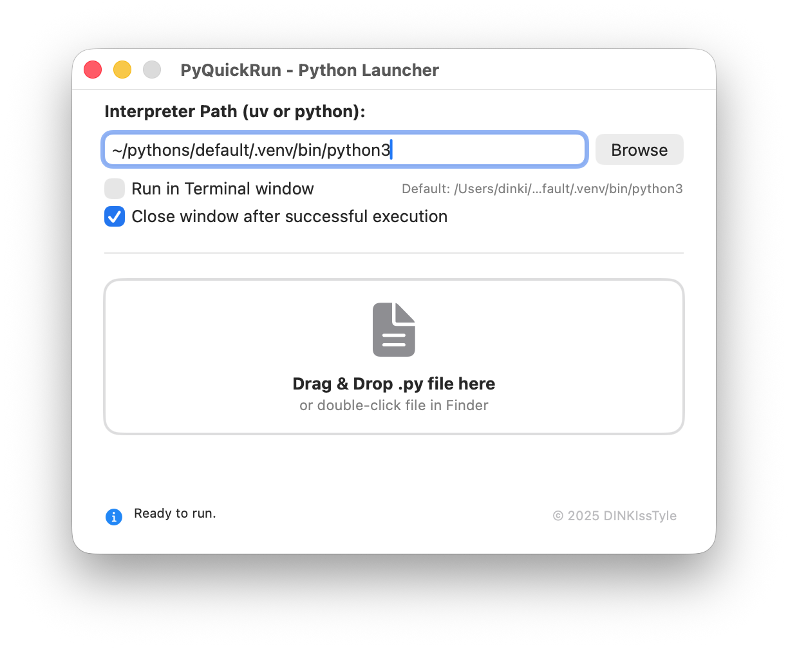

# PyQuickRun

A launcher that makes it easy to run Python scripts using predefined environments — including different operating systems, interpreters, and virtual environments.

  
      
  

---

## 🚀 Per-Script Configuration (Magic Comments)

PyQuickRun allows each Python script to specify its own interpreter or execution mode using **magic comments**.  
This is useful for multi-OS development, per-project virtual environments, and scripts that require terminal interaction.

Magic comments must appear within the **first 20 lines** of the script.

---

## 🧩 Syntax
#pqr [os] [mode] [path]

---

## 📌 Examples

### **1. Cross-Platform Paths**

The launcher automatically selects the correct interpreter based on the OS.

**#pqr mac** ~/pythons/project_a/.venv/bin/python  
**#pqr win** C:\Users\dinki\pythons\project_a\venv\Scripts\python.exe  
**#pqr linux** /home/dinki/pythons/project_a/venv/bin/python  

import sys
.
.

### **2. Force Terminal Execution**

Useful for scripts that require input() or TUI applications.

#pqr mac **terminal** ~/pythons/default/.venv/bin/python

### 🔧 Behavior Logic
	1.	Priority: #pqr magic comments override global launcher settings.
	2.	Fallback: If no magic comment exists, PyQuickRun uses the global interpreter path.
	3.	OS Detection: macOS uses only #pqr mac, ignoring win or linux entries.
  
  
  
  
  
